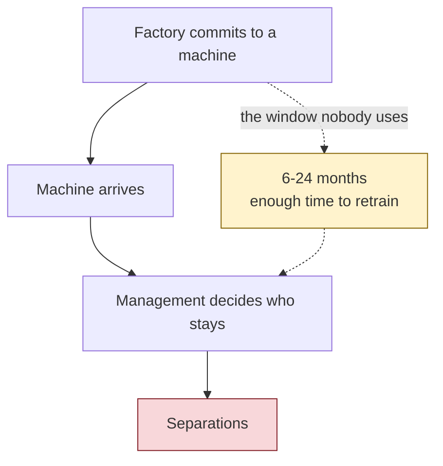

# The problem

Automation reaches a garment factory as a purchase order, not as a plan. The
machine arrives, and only then does management decide who stays.

## The evidence

Carried from the project research documents. **Re-verify against primary
sources before quoting these externally** — see [[Decision log]].

| Figure | Claim |
| --- | --- |
| **~4 million** | RMG workers in Bangladesh, most of them women |
| **60%** | of current female RMG employment could be displaced by 2041 without intervention (CPD 2026 policy brief) |
| **80%** | of surveyed Dhaka factories planned semi-automated machine purchases within two years (2023 survey) |

One more finding shaped the design. Reporting on Bangladeshi factories that
automated found productivity rose — by 5–10% on semi-automated installs, up to
25% with line monitoring — but **worker incomes did not follow**, and women
were pushed out disproportionately. That outcome is what this product exists
to get ahead of.

## Why it is not already solved

The window between commitment and arrival is long enough to retrain most of
the people affected. Nothing currently uses it, because nobody has connected
the purchase plan to the roster.

## The competitive gap

| Who | What they do | Why the gap stays open |
| --- | --- | --- |
| Reskilling providers | Generic operator training | Not predictive, not tied to a specific purchase |
| Garments ERP | Production and material forecasting | Production-level, not worker-level |
| Research programmes | Publish automation impact studies | Research output, not a tool a factory can run |

The unoccupied slot: **predictive, tied to the actual machine purchase, and
per-role reskilling matched to it**.

---

Related: [[What is ALE Insight]] · [[Who it is for]] · [[Risk knowledge base]]
