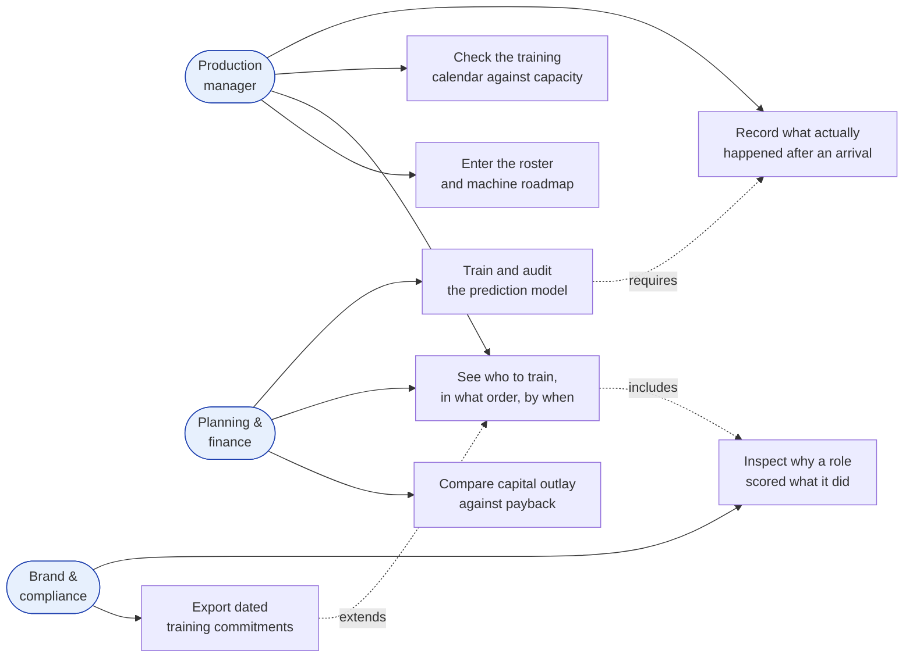

# Who it is for

Three people look at the same plan for different reasons. Each gets the view
that answers their own question.

## Production manager

*You know which machines are coming. You need to know who to train, in what
order, and by when — against the training capacity you actually have.*

Lands on [[Pages and navigation|Plan]]. Capacity is the binding constraint in
every schedule, which is why [[Training and wages|training seat capacity]] is
a first-class input rather than an afterthought.

## Brand and compliance

*You need evidence that a supplier saw the change coming and acted on it:
dated training commitments, not a statement of intent.*

Lands on **Report**. This is the artifact with value outside the factory, and
it is the reason a factory pays — compliance pressure from brands, not
conscience. Deliberately a list of commitments, never a risk register.

## Planning and finance

*You need the purchase case: capital outlay, payback period, and what each
machine creates as well as what it removes.*

Lands on **Machines** and the economics panel on **Overview**. See
[[Machine catalogue]].

> A short payback beside a large net displacement is the combination worth
> flagging: it means the purchase is very likely to proceed, so the training
> window is the only variable actually in play.

---

Related: [[Pages and navigation]] · [[Machine catalogue]] · [[Recording outcomes]]
