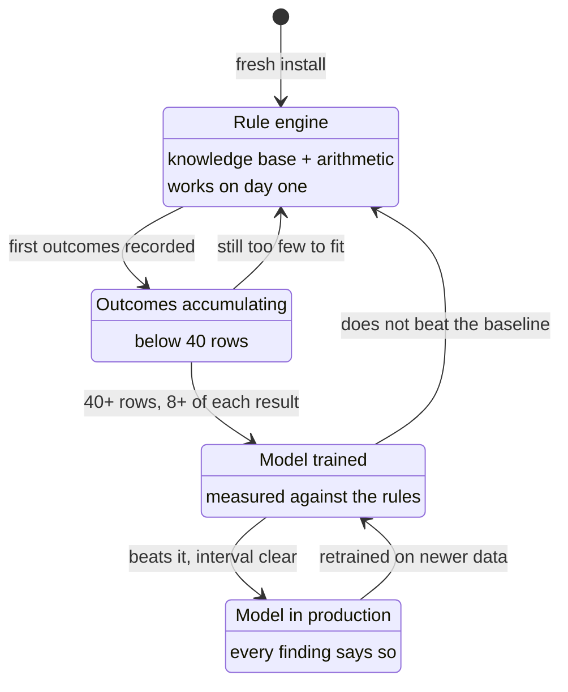

[← Documentation index](../README.md)

# What is ALE Insight

A planning tool for ready-made garment factories. It answers one question:

> A machine is arriving. Who do I train, in what order, and by when?

Not *who is at risk* — that is a fact, and facts get looked up once. The
schedule is what a factory cannot work out on its own and will come back to.

## The exchange

A factory supplies two things:

| Input | Shape |
| --- | --- |
| **Role headcounts** | A handful of rows. Not one per worker, and no names. |
| **Machine roadmap** | Which catalogue machines are arriving, and when. |

It gets back, per arrival: who is exposed and why, how many workers, which
training answers it, **the date training has to begin**, and what it costs.

Findings are ordered by how soon training must start, not by risk score. A
role scoring 41 with a deadline next month outranks one scoring 74 with a
year of slack.

## What it deliberately is not

**It is not a redundancy tool.** The output that says *train these 40 first*
is the same output that says *these 40 are most replaceable*. Four rules
enforced in the database keep it from becoming the second thing — see
[Ethical constraints](../09-ethics/ethical-constraints.md).

**It does not ship with a trained model.** Predicting displacement needs
labelled history, which exists only inside factories. There is no data any
vendor could honestly have pre-trained on. See [ML overview](../05-machine-learning/ml-overview.md).

**It ships with no customer data.** A fresh install has reference data — the
role taxonomy, the [Machine catalogue](../03-domain/machine-catalogue.md), the [Risk knowledge base](../03-domain/risk-knowledge-base.md) — and no
factories. A seeded "demo factory" would put invented numbers where a user
expects their own.

## Two engines, one score

Every finding carries a badge naming which engine produced its number. See
[Rule engine](../04-engine/rule-engine.md) and [The baseline gate](../05-machine-learning/the-baseline-gate.md).

## Where the name comes from

[The ALE model](the-ale-model.md) — Anticipate, Lead, Evolve.

---

Next: [The problem](the-problem.md) · [Who it is for](who-it-is-for.md) · [System architecture](../02-architecture/system-architecture.md)
