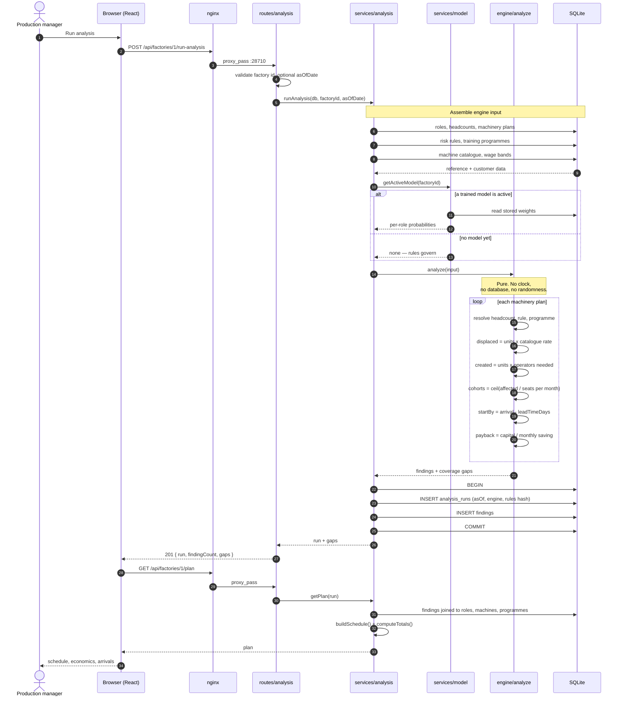
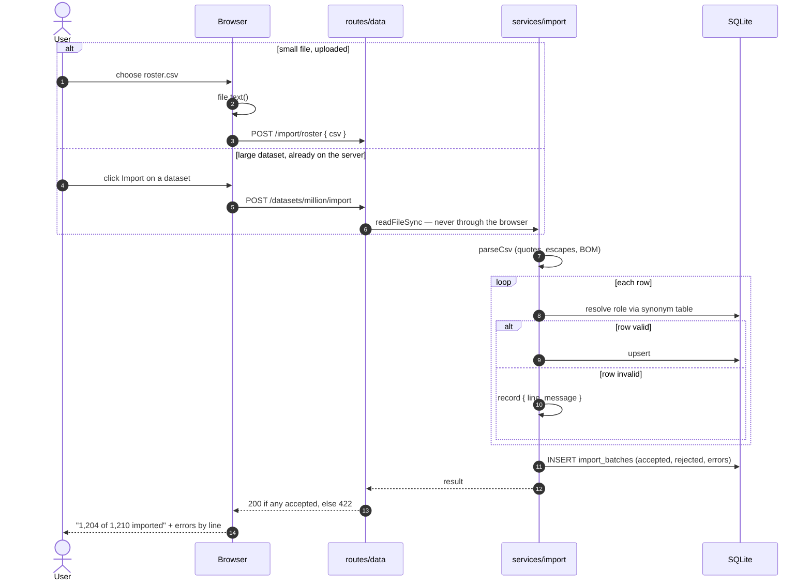

# Request lifecycle

What happens between clicking **Run analysis** and a number appearing.

## Things worth noticing

**Step 4 — the model is consulted, not assumed.** If no model is active, or a
stored model has no usable payload, the rules produce the score and the finding
records `score_source: "rules"`.

**The engine loop never touches the database.** Every value it needs was
gathered in steps 5–7. That is what makes [[Golden test|the golden snapshot]]
possible.

**The write is one transaction.** A partially-written run would be worse than
no run: the report built from it would be internally inconsistent.

**Reading the plan is a second request.** Running the analysis produces a run
id; rendering is a separate read. That keeps a slow analysis from blocking the
page, and lets an old run be re-read by id at any time.

## A CSV import, for contrast

Partial success is the normal case. A 3,000-row HR export will have a handful
of bad rows, and `row 812: unknown role "Sewing Opr"` is actionable where
"import failed" is not. See [[CSV import]].

---

Related: [[Rule engine]] · [[CSV import]] · [[System architecture]]
