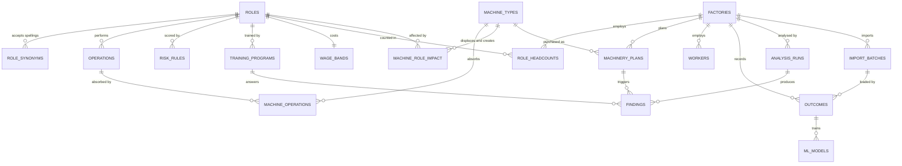

[← Documentation index](../README.md)

# Data model

Sixteen tables across seven migrations. Grouped by what they are for.

## Reference data — ships with the product

| Table | Why it exists |
| --- | --- |
| `roles` | Canonical ids. The fix for the defect where three spellings of one role never matched. |
| `role_synonyms` | Every accepted spelling, normalised. 99 rows across 16 roles. |
| `operations` | **Machines replace operations, not roles.** The single best within-role discriminator. |
| `machine_types` | Cost, lead time, operators required, throughput, sources. |
| `machine_operations` | Which operations a machine absorbs, and how much of each. |
| `machine_role_impact` | Per unit, per role: **displaced and created**. |
| `risk_rules` | Score, band, rationale, source, confidence — all `NOT NULL`. |
| `training_programs` | Duration, seat capacity, cost. Without it "recommended training" is a wish. |
| `wage_bands` | Makes payback and cost comparison computable. |

## Customer data — arrives by import

| Table | |
| --- | --- |
| `factories` | |
| `role_headcounts` | The low-friction input: a handful of rows |
| `machinery_plans` | Points at the catalogue; `headcount_displaced_per_unit` is a nullable **override** |
| `workers` | Pseudonymous. **No name column, by design.** |
| `outcomes` | The only source of ML labels. Features stored as at the arrival date. |
| `import_batches` | Row counts and line-level errors per file |

## Output

| Table | |
| --- | --- |
| `analysis_runs` | `as_of_date` + engine version + rules hash — makes a run reproducible |
| `findings` | One per arrival per role. `training_program_id` is `NOT NULL`. |
| `ml_models` | Every fit with its cross-validated metrics and the baseline it was measured against |

## Three constraints that carry weight

**`findings.training_program_id NOT NULL`** — no risk score can exist without
a recommended transition. The engine reports a *coverage gap* rather than
emitting a bare score. See [Ethical constraints](../09-ethics/ethical-constraints.md).

**`workers` has no name column** — `external_ref` is the factory's own HR
identifier. An import carrying a `name` column is rejected with an
explanation.

**`outcomes` stores features as at the arrival date** — reading today's values
for a decision made two years ago leaks the future into the past and produces
a model that validates well and predicts nothing.

## Migrations

| | |
| --- | --- |
| `001_init` | The nine core tables |
| `002_taxonomy_detail` | `roles.department`, `factories.product_mix` |
| `003_english_labels` | Dropped `label_bn`, renamed `label_en` → `label` |
| `004_machine_catalogue` | Operations, machines, impact, wages; rebuilt `machinery_plans` |
| `005_finding_analytics` | Persisted net effect, payback, cost ratio |
| `006_real_data_and_ml` | Imports, outcomes, models; `findings.score_source` |
| `007_richer_features` | Worker detail, the second target, model diagnostics |

Analytical fields are **stored, not recomputed on read**: a report sent to a
buyer months ago still shows the figures it was sent with, even after the
catalogue has been revised.

---

Related: [System architecture](system-architecture.md) · [Roles and operations](../03-domain/roles-and-operations.md) · [Machine catalogue](../03-domain/machine-catalogue.md)
