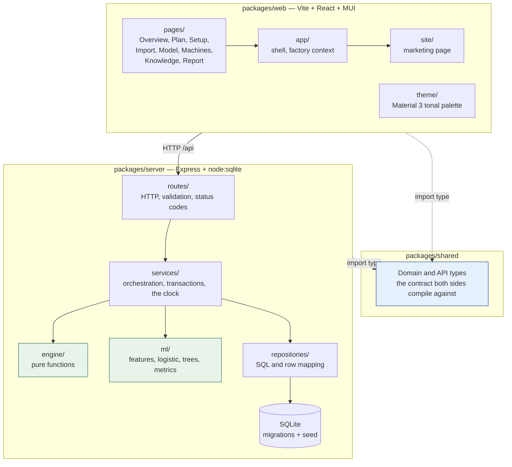
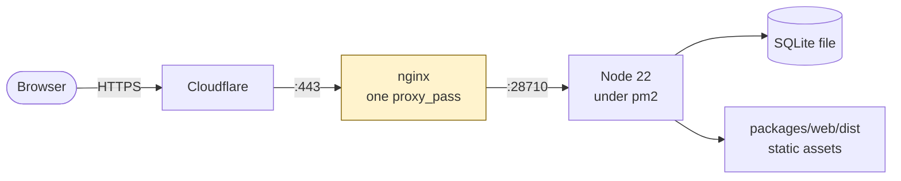

[← Documentation index](../README.md)

# System architecture

Three packages, one dependency direction, no cycles.

## The layers, and what each may not do

| Layer | Does | Must never |
| --- | --- | --- |
| `routes/` | Validation, status codes, error shapes | Contain business logic |
| `services/` | Orchestration, transactions, reads the clock | Contain arithmetic worth testing alone |
| `engine/` | Pure functions | Touch the database, the clock, or randomness |
| `ml/` | Fit, score, evaluate | Touch the database |
| `repositories/` | SQL and row mapping | Make decisions |

**The engine is pure on purpose.** It is what makes the [Golden test](../04-engine/golden-test.md)
possible, and it is the part most likely to change as the knowledge base
grows. `asOfDate` is passed in rather than read from a clock, so a run is
reproducible years later.

## Why the shared package exists

Both sides `import type` from `@ale/shared`. A renamed field becomes a
compile error on both sides instead of a silently empty panel in the browser.

Because every server import is type-only, Node erases them entirely — the
server never loads that package at runtime.

## In production

One process serves both the built frontend and `/api`:

One upstream means nginx never changes when the app is rebuilt, and there is
no static root to keep in step with a deploy. See [Deployment](../08-operations/deployment.md).

---

Related: [Data model](data-model.md) · [Request lifecycle](request-lifecycle.md) · [Technology choices](technology-choices.md)
