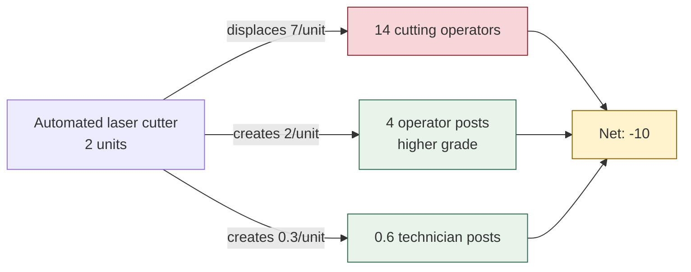

# Machine catalogue

## What changed, and why it matters

Displacement used to be `headcount_displaced_per_unit`, **typed in by the
user** — the product asking the factory for the answer it exists to supply.

Thirteen machine types now carry the figures, with sources. A factory that
knows its own line better can still override, and the interface says which
findings were derived and which were overridden.

## What each entry holds

| Field | |
| --- | --- |
| `capital_cost_bdt`, `install_lead_weeks` | The purchase case |
| `operators_required` | People the machine **needs**. Fractional where one operator tends several units. |
| `throughput_workers_equivalent` | Output of one unit in manual workers |
| `maintenance_hours_per_month` | Feeds technician demand |
| `health_safety_note` | Set where the machine removes hazardous manual work |
| `source_ref`, `confidence` | `sourced` or `estimated`, shown beside the number |

## The half the original model could not express

A machine both destroys and creates. `machine_role_impact` records both:

> A plan reporting only displacement tells half the truth.

## What this makes computable

| | |
| --- | --- |
| **Posts created** | Operators to run it, technicians to service it |
| **Net workforce change** | Displaced minus created — frequently not the figure a factory expects |
| **Payback period** | Capital over the **net** wage bill removed; the created posts still get paid |
| **Retraining cost ratio** | Training bill against one year of the payroll it protects. Runs **2–5%**. |

That last figure is the strongest argument the tool can hand a factory, and it
was not computable before the catalogue existed.

## Sourced entries

Three rest on published specifications rather than reasoning:

| Machine | Reported |
| --- | --- |
| CNC / laser cutter | "no more than 2 workers" to operate; "the productivity of 4–10 workers" |
| Automated sewing unit | one worker tends six machines at 4–5× manual output |
| Laser + ozone finishing | "entirely replaced manual scraping"; process cut from ~90 steps to 15 |

Everything else is marked `estimated`.

## The health and safety case

Laser and ozone finishing replaces manual sanding, scraping and permanganate
spraying — processes documented as damaging to worker health. Adoption is
**compliance-driven**, which means it moves faster than a cost case predicts
and the purchase will not be delayed for the workforce.

> That makes the training schedule the whole argument.

---

Related: [[Risk knowledge base]] · [[Scheduling arithmetic]] · [[Roles and operations]]
