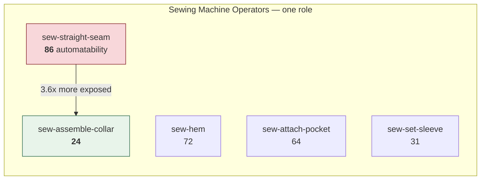

# Roles and operations

## The defect this fixes

The original specification seeded risk rules under `"Cutting Machine
Operators"` while the worker and machinery tables used `"Cutting Machine
Operator"`, and matched them with **exact string equality**. Its first run
would have returned an empty array.

The fix is a canonical `roles` table with a synonym index — 99 normalised
spellings across 16 roles. All of these reach the same row:

```
"Cutting Machine Operator"      "Cutting Machine Operators"
"cutting operator"              "cutter operator"
"  CUTTING  MACHINE  OPERATORS  "
```

Normalisation lowercases, expands `&` to `and`, strips punctuation and
collapses whitespace. Pinned by `tests/roles.test.ts`.

## The sixteen roles

Grouped by where they sit on the floor.

| Department | Roles |
| --- | --- |
| **Cutting** | Cutting Machine Operators · Fabric Spreaders · Fabric & Pattern Cutters |
| **Sewing** | Sewing Machine Operators · Helpers & Line Feeders · Embroidery Machine Operators · Screen Printing Operators |
| **Finishing** | Finishing & Ironing Staff · Packing Staff · Quality Inspectors · Washing Plant Operators |
| **Support** | Line Supervisors · Store & Inventory Clerks · Merchandisers |
| **Technical** | Maintenance Technicians · Industrial Engineers |

## Why operations matter more than roles

**Machines replace operations, not roles.** Within one role the spread is
enormous:



Two operators, same job title, same tenure — one at 86, one at 24. **No amount
of qualification data recovers that.** It is the single best within-role
discriminator, and it is why `operations` exists as its own table.

The engine uses it twice: directly as `operation_automatability`, and as the
interaction term `exposure_concentration` — automatability × share of time
actually spent on that operation. See [[Features]].

32 operations are catalogued, each with an `automatability` score (0–100) and
a skill level.

---

Related: [[Machine catalogue]] · [[Risk knowledge base]] · [[Features]]
