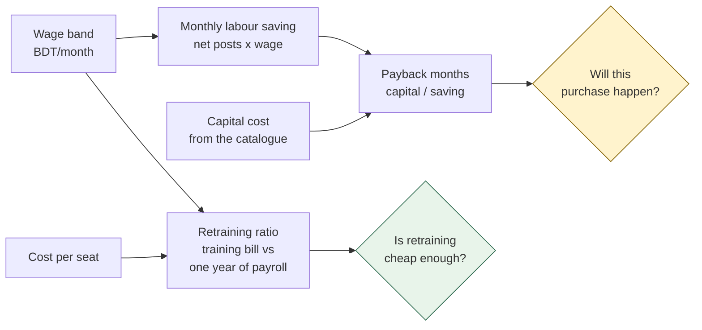

[← Documentation index](../README.md)

# Training and wages

## The training catalogue

16 programmes, one per role. Without this table, "recommended training" is a
sentence; with it, the engine can answer *how many months of lead time does
this purchase require, and what will it cost*.

| Field | Why it matters |
| --- | --- |
| `duration_weeks` | The final cohort still needs the full programme before the machine lands |
| `seats_per_month` | **The binding constraint in every schedule** |
| `cost_per_seat_bdt` | Makes the retraining ratio computable |
| `provider` | In-house, vendor, or external institute |

> Seat capacity is the constraint that decides the answer. A wrong number here
> changes the schedule, not just the presentation — replace these during
> onboarding.

One entry is deliberately the widest intake in the catalogue: the
**helper-to-operator progression track**, at 60 seats/month. Helpers are the
entry point into the factory, and automating bundle transport closes the main
progression path into operator grades. That second-order effect needs planning
for explicitly.

## Wage bands

Monthly **cost to the employer** — wage plus overtime, bonuses and benefits.
Not take-home pay.

Anchored on two published figures:

- The Bangladesh Minimum Wage Board set the RMG minimum at **BDT 12,500** (Dec 2023)
- Reporting puts a sewing operator's total monthly income with overtime at **BDT 20,000–25,000**

Those two anchor the operator and helper bands and are marked `sourced`.
Everything else is scaled by grade and marked `estimated`.

## What the two tables unlock

The retraining ratio typically lands at **2–5%** — training costs a few percent
of one year of the wages it protects. That is the number to put in front of a
factory owner.

---

Related: [Machine catalogue](machine-catalogue.md) · [Scheduling arithmetic](../04-engine/scheduling-arithmetic.md) · [Rule engine](../04-engine/rule-engine.md)
