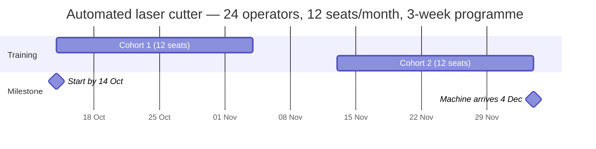

# Scheduling arithmetic

The part a factory cannot work out on its own.

> *"Sewing operators are at 68%"* is a fact.
> *"Run 40 seats in March, 40 in April, and you are covered before the units
> land"* is a plan.

## Working backwards

Cohorts run back to back at one intake per month, and the **final cohort still
needs the full programme duration** before the machine arrives.

```
leadTimeDays = (cohorts - 1) x 30  +  durationWeeks x 7
startByDate  = arrivalDate - leadTimeDays
```

A worked example — an automated laser cutter, 2 units, arriving 4 December:



```
24 workers / 12 seats  = 2 cohorts
leadDays = (2-1) x 30 + 3 x 7 = 51
startBy  = 4 Dec - 51 days    = 14 October
```

Training completes **exactly** as the machine lands.

## One shared function, two callers

`leadTimeDays()` is exported from the engine because the buyer report needs the
same figure to state a completion date.

This was a real bug: the report computed lead time separately and got a
different answer, producing commitments claiming training finished **three
weeks after** the machine it was meant to precede. A regression test now asserts
no commitment can outrun its arrival.

## Schedule status

| Status | |
| --- | --- |
| `on_track` | More than 30 days until training must start |
| `starts_soon` | Within 30 days |
| `overdue` | `startByDate` has already passed |

## The calendar

Cohorts are laid out one intake per month from `startByDate`. Where that date
has **already passed**, the intake is clamped to the current month rather than
drawn in the past — the deadline is still reported as missed via
`scheduleStatus`, but the calendar stays actionable.

## Months until impact

Displayed as `round(days / 30.44)`. This matches the worked example in the
original specification — 4 September to 1 December reads as **"3 months"**,
where strict completed-month arithmetic says 2.

Planning conversations round. Both functions exist; the product displays the
rounded one.

---

Related: [[Rule engine]] · [[Training and wages]] · [[Machine catalogue]]
