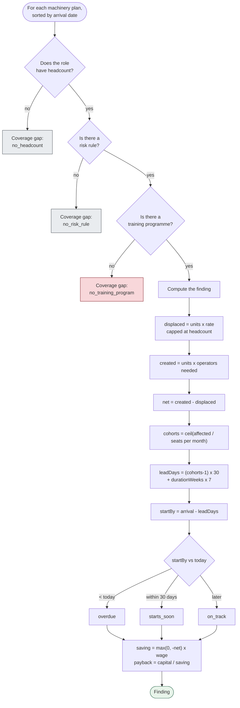

[← Documentation index](../README.md)

# Rule engine

A pure function of `(roster, machinery plans, knowledge base, as-of date)`.
No database, no clock, no randomness — the same input produces the same output
forever, which is what makes the [Golden test](golden-test.md) able to detect an unintended
change to any rule.

> There is no machine learning here. The knowledge base is the intelligence;
> this file is the arithmetic that turns it into a schedule.

## The loop

## The gap that is not an accident

`no_training_program` produces a **coverage gap, never a score**. A role with
no recommended transition would otherwise become a bare displaceability figure,
which is the one artifact this product does not produce.

The engine enforces it before the database does, and
`findings.training_program_id NOT NULL` catches anything that slips past. See
[Ethical constraints](../09-ethics/ethical-constraints.md).

## Where the model fits in

If a trained model is active for the factory, its probability replaces
`riskScore` — but the **band and the rationale still come from the knowledge
base**, so a model number is never shown without an explanation beside it. The
finding records `score_source`.

## Two deliberate cappings

**Workers affected is capped at role headcount.** Forty units × 12 displaced
cannot displace 480 people from a roster of 260.

**Totals cap per role before summing.** Two machines hitting the same role must
not report more people affected than the factory employs.

## Weighted risk

The headline percentage is the **headcount-weighted mean of each role's base
score**, deliberately independent of the machinery plans. It describes the
workforce as it stands; the findings below it describe committed purchases.

---

Related: [Scheduling arithmetic](scheduling-arithmetic.md) · [Risk knowledge base](../03-domain/risk-knowledge-base.md) · [Golden test](golden-test.md)
