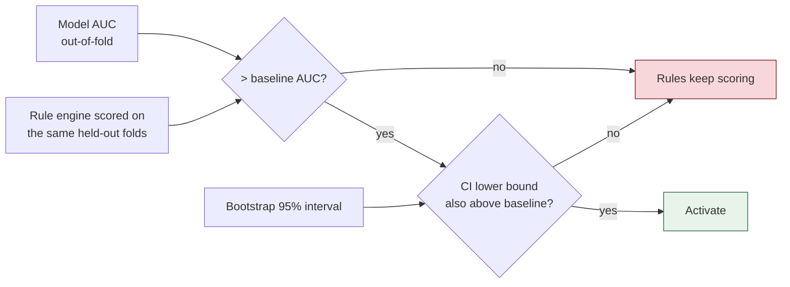

# The baseline gate

> The decision matters more than the fit.

A model that cannot beat the lookup table it replaces is **not an
improvement** — it is the same answer with less explanation.

## The rule



Two conditions, not one:

1. The model's cross-validated AUC exceeds the rule engine's on the **same
   held-out folds**
2. The **lower bound of its confidence interval** is also above the baseline

The second condition is what stops a model being promoted on a difference
inside the noise. Ties go to the rules.

## The model is stored either way

A failing model is fitted, stored with its metrics, and **not activated**. The
status message says so plainly:

> *Stored but not activated: 0.612 against a rule baseline of 0.598 is not a
> demonstrated improvement.*

That record matters — it shows the attempt was made and what it measured,
rather than leaving a silent gap.

## It bites

A test feeds pure noise with a baseline that knows the answer, and asserts the
rules survive:

```
a model inside the noise does not displace the rule engine  ✓
```

This is the test that would fail if someone "improved" the gate into a
rubber stamp.

## Why this shape

Three reasons, in order of weight:

1. **Honesty.** Early on there is not enough evidence to justify replacing a
   transparent lookup with a fitted one. Saying so is better than pretending.
2. **Explicability.** A rule score comes with a rationale and a citation. A
   model score comes with coefficients. Trading the first for the second should
   require winning.
3. **Safety.** A model fitted on 45 rows will overfit. The gate catches it
   without anyone having to notice.

---

Related: [[Training pipeline]] · [[Metrics explained]] · [[ML overview]]
