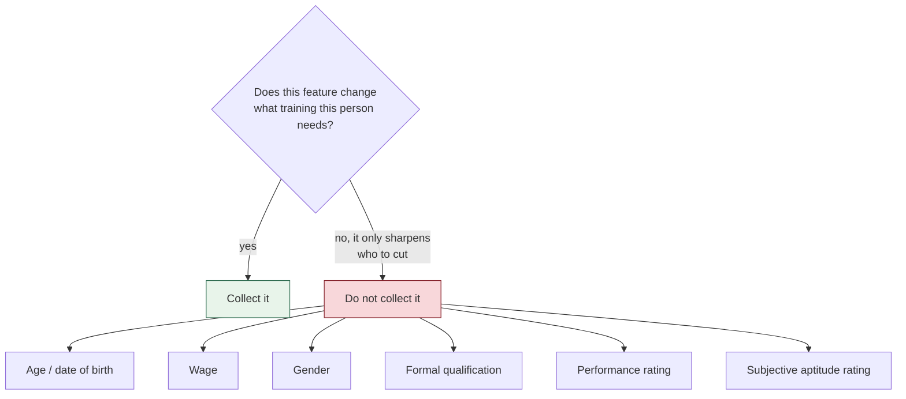

[← Documentation index](../README.md)

# Features

Thirteen features. The rule governing every one:

> Only features that could plausibly **differ between two workers in the same
> role**. A feature constant within a role teaches the model nothing the rule
> engine did not already know.

## The thirteen

| Feature | Source | Why |
| --- | --- | --- |
| `tenure_years` | outcome row | Weak alone, useful with grade |
| `operations_known` | outcome row | **Best single predictor of redeployability** |
| `skill_grade` | outcome row | Ordinal: entry → specialist |
| `operation_automatability` | joined from `operations` | The 86-vs-24 spread inside one role |
| `primary_operation_share` | outcome row | How much of their time it takes |
| **`exposure_concentration`** | *computed* | automatability × share |
| `time_to_competency_weeks` | outcome row | Observed ramp-up, not an opinion |
| `prior_training_pass_rate` | computed | passed / attempted |
| `literacy` | outcome row | Predicts *which training format works* |
| `digital_comfort` | outcome row | Same |
| `machine_displacement_per_unit` | joined from catalogue | How hard this arrival hits |
| `role_base_risk` | joined from rules | **The rule engine's score, as a prior** |
| `trained_before_arrival` | outcome row | The strongest protective factor observed |

## The interaction term

`exposure_concentration = automatability × share` exists because **a linear
model cannot form a product itself**.

A highly automatable operation is only a real exposure if the worker actually
spends their time on it. Neither factor alone says that. On generated data this
term ranks third by permutation importance, so it earns its place.

## Role is a prior, not a competitor

`role_base_risk` is a feature. Granular data should **beat** the rule engine's
role score, not replace it — keeping both lets the model lean on role where it
has no worker detail and override it where it does.

## What is deliberately excluded



> A model trained on those learns whichever bias produced the historical
> decisions and launders it as a prediction.

**Performance rating** is the most dangerous of them. It genuinely predicts
retraining success — and it instantly turns the output into a ranked *who is
worst* list.

**"Learning ability"** has no clean measurement. A supervisor rating is a proxy
for supervisor opinion, carrying gender, age and favouritism bias.
`time_to_competency_weeks` replaces it: weeks from training start to standard
output, already recorded in most IE systems, objective, and it encodes nobody's
opinion.

**Formal qualification** in RMG mostly encodes socioeconomic background. The
genuinely useful part of it is literacy, captured directly.

**Gender** is the hard one. The entire premise rests on women being
disproportionately affected, so the impact should be reported — but a
per-worker flag is exactly what someone would filter on. The recommendation is
aggregate at role level only, never individually filterable.

## Missing values are neutral, not zero

```
tenureMonths      ?? 24     (not 0 — zero tenure is a real, meaningful value)
automatability    ?? 50
primaryShare      ?? 0.6
passRate: 0 trainings → 0.5 (not 0/0, which would read as total failure)
```

Conflating *"new hire"* with *"we don't know"* teaches the model something
false.

---

Related: [ML overview](ml-overview.md) · [Training pipeline](training-pipeline.md) · [Ethical constraints](../09-ethics/ethical-constraints.md)
