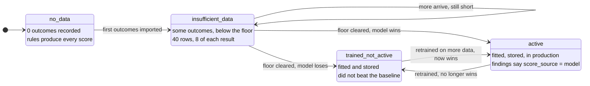

[← Documentation index](../README.md)

# ML overview

## Why there is no pre-trained model

A supervised model needs **labelled outcomes** — records of what actually
happened to workers after a machine arrived. That data exists only inside
factories.

> There is no data any vendor could honestly have pre-trained on. Shipping a
> model with invented weights and calling it a prediction would be the single
> most dishonest thing this product could do.

So the product ships the **pipeline**, not a model: outcome recording, a
genuinely trainable model with cross-validated metrics, and an honest cold
start on the [Rule engine](../04-engine/rule-engine.md) until a model measurably wins.

## The lifecycle

The floor is not arbitrary: below 40 rows with at least 8 of each result, a
fit is noise. Training **refuses** and says why, rather than producing a model
nobody should trust.

## Two targets

| Target | Label | How fast labels accrue |
| --- | --- | --- |
| **Displacement** | Did this worker lose their job? | Years — only knowable after a machine lands |
| **Retraining success** | Did this worker pass the training? | **Weeks** — knowable after every cohort |

The second was added because the first accrues far too slowly to build a model
from. It also answers the more actionable question: *who do I put in the next
40 seats*.

`redeployed` counts as **retained** for the displacement target. The worker
kept a job, which is the outcome the product exists to produce; treating it as
displacement would train the model to call a success a failure.

Rows where nobody was enrolled are **excluded** from the retraining model
rather than counted as failures.

## What it actually learns

On a million generated rows the two models find genuinely different drivers —
which is the check that the features are doing real work:

| Displacement | Retraining success |
| --- | --- |
| trained before arrival | operations known |
| operations known | **literacy** |
| exposure concentration | **time to competency** |
| machine displacement rate | digital comfort |

---

Related: [Features](features.md) · [Training pipeline](training-pipeline.md) · [The baseline gate](the-baseline-gate.md) · [Recording outcomes](../06-data/recording-outcomes.md)
