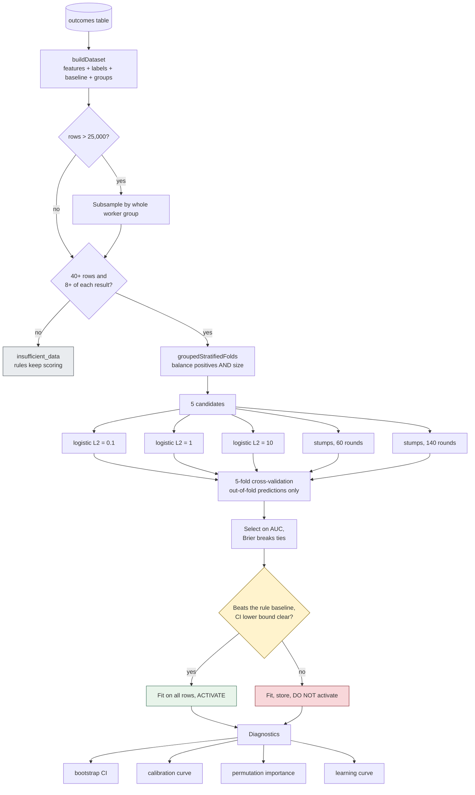

[← Documentation index](../README.md)

# Training pipeline

## Group-aware folds

One worker appears **once per arrival they lived through**. Splitting those
rows across folds lets the model see the same person in training and in test,
inflating every metric invisibly.

Folds are assigned by whole group — and balanced on **both positives and total
size**. That second part was a real bug:

| | fold 0 | fold 1 | fold 2 | fold 3 | fold 4 |
| --- | --- | --- | --- | --- | --- |
| rows | 794 | 798 | 798 | **4411** | 797 |
| positives | 453 | 453 | 453 | 452 | 453 |

Every fold scored 0.62–0.67 individually, yet the pooled out-of-fold AUC came
out at **0.40 — below random**. Fold 3 trained at a 10% positive rate while the
others trained at 57%; their scores were not on the same scale, so pooling them
measured the mismatch rather than the model. After balancing both axes the
ensemble went **0.40 → 0.757**.

`tests/ml.test.ts` now checks fold composition directly, because the failure is
invisible from the metric alone.

## Two algorithms

| | |
| --- | --- |
| **Logistic regression, L2** | ~60 lines. Standardised inputs, class-balanced, early stopping on gradient norm. Readable by the people who will argue with it. |
| **Gradient-boosted stumps** | Depth-1 trees. Finds thresholds — you become redeployable *around* 3–4 operations, not gradually — that an additive model can only approximate with a slope. |

Class balancing matters more than it sounds. Displacement is the minority
class; without inverse-frequency weights the fit minimises loss by predicting
"retained" almost everywhere, scoring well on accuracy and being useless for
the only decision anyone makes with it.

## The sampling cap

Above **25,000 rows** the dataset is subsampled by whole worker group.

Full-batch gradient descent is O(iterations × rows × features), run per
candidate per fold. At a million rows that is tens of billions of operations
for a model whose coefficients stopped moving long before. At 25,000 rows the
standard error on AUC is about **0.006** — far tighter than any decision made
from it.

The status response reports **rows fitted against rows available**, because a
model quietly trained on a fortieth of the data would be a misleading thing to
hide.

The learning curve confirms the choice empirically: `6250→0.781  12500→0.787
18750→0.788  25001→0.789`. The remaining 970,000 rows would buy the third
decimal place.

---

Related: [The baseline gate](the-baseline-gate.md) · [Metrics explained](metrics-explained.md) · [Features](features.md)
