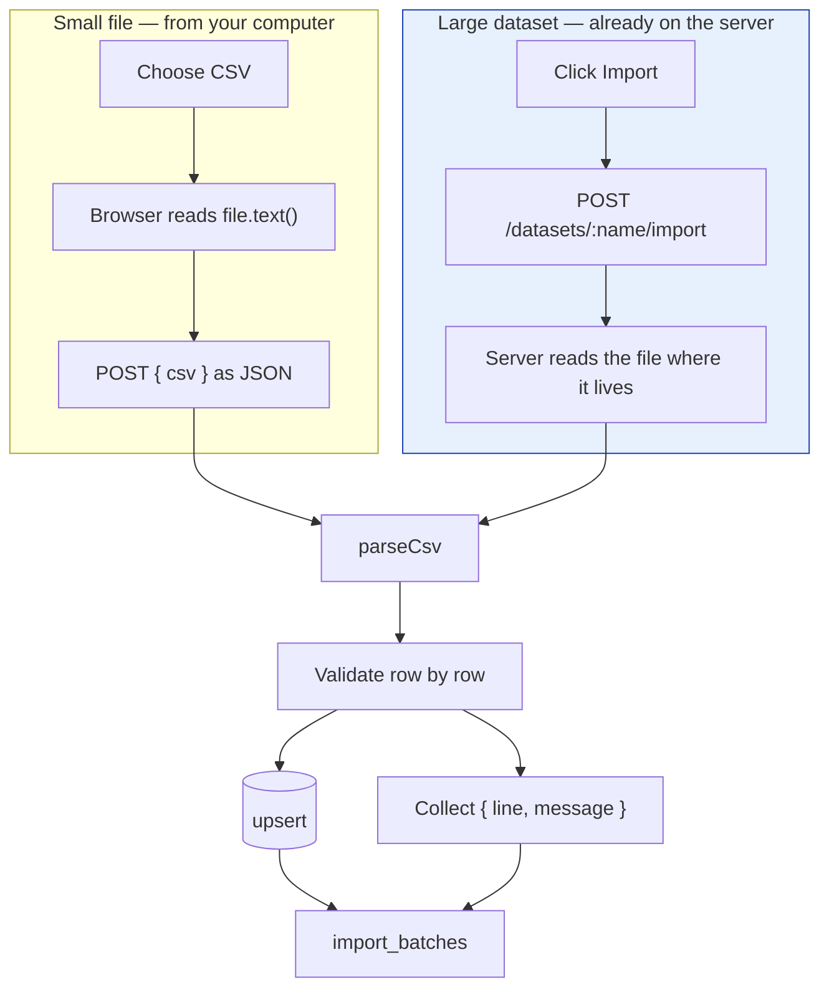

[← Documentation index](../README.md)

# CSV import

Four importers. Every row is validated and failures come back with a **line
number and a reason**.

## Partial success is the normal case

A 3,000-row HR export will have a handful of bad rows. All-or-nothing means one
typo blocks the entire onboarding.

```
line 3: Unknown role "Astronaut". See GET /api/roles for accepted names.
line 4: "workers" must be a whole number, got "not-a-number".
```

Line numbers **count the header**, so they match what a spreadsheet shows.

The endpoint returns `200` if any row landed, `422` if none did — and the body
is identical either way, because the row-level report is the useful response,
not a failure to surface as an exception.

## Two paths in



A million-row outcomes file is **~140MB**. Posting it as a JSON string would
exceed any sane body limit, double in memory as a UTF-16 string, and make the
browser hold the whole thing. Reading it where it already lives avoids all
three. See [Data generator](data-generator.md).

## Why the parser is hand-written

`split(',')` corrupts every row containing a quoted comma — which here means
every `"Finishing, Ironing & Pressing"`. The failure is **silent**: you get
data, just wrong data.

Handled: quoted fields, escaped `""`, newlines inside quotes, and the BOM Excel
writes (which otherwise becomes part of the first header name and never
matches anything).

## Header matching

Case-insensitive, and ignores spaces, hyphens and underscores. `Worker Ref`,
`worker_ref` and `worker-ref` are the same column.

## The four importers

| Kind | Required | Notable behaviour |
| --- | --- | --- |
| `roster` | `role`, `workers` | Upsert by (factory, role) |
| `machinery` | `machine_type`, `arrival_date` | Affected role **defaults to whichever the machine hits hardest**, so a factory need not know the catalogue |
| `workers` | `worker_ref`, `role` | **A file containing a `name` column is rejected** |
| `outcomes` | `worker_ref`, `role`, `arrival_date`, `outcome` | Features stored as supplied, not read from the worker's current record |

## The name rejection

```
Remove the name column — this system stores pseudonymous references only.
```

That is a design decision surfaced as a validation error, not an oversight. See
[Ethical constraints](../09-ethics/ethical-constraints.md).

---

Related: [CSV templates](csv-templates.md) · [Recording outcomes](recording-outcomes.md) · [Data generator](data-generator.md)
