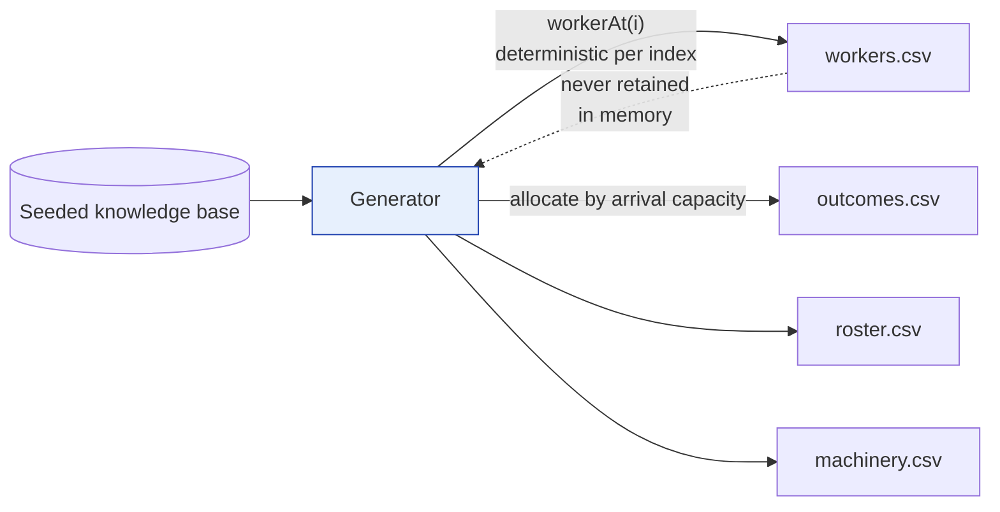

[← Documentation index](../README.md)

# Data generator

```bash
npm run generate:data -- --workers 8000 --arrivals 18 --out ./generated
```

Produces four importable CSVs. **This is test data**, written to a directory you
name; nothing is written into the product, and the app itself ships with no
factories.

| Flag | Default | |
| --- | --- | --- |
| `--workers` | 5000 | Roster size, split across roles in realistic proportions |
| `--arrivals` | 6 | Past arrivals, which is what produces outcome rows |
| `--out` | `./generated` | Output directory |
| `--seed` | 20260911 | Reproducible — same seed, same files |
| `--db` | the project database | Where to read the knowledge base from |

## Why it reads the database

The generator does not invent roles or machines. It reads the seeded knowledge
base and uses the **real** figures: a worker on `sew-straight-seam` is exposed
because that operation genuinely scores 86 automatability, and a laser cutter
displaces at the rate recorded in `machine_role_impact`. A model trained on the
output therefore learns the same relationships it would learn from a real
factory, rather than an artefact of the generator.

## Why the data is noisy on purpose

The generating process is:

```
logit = -2.1
      + 3.6 × (operation automatability × share of time on it)
      - 0.55 × (operations known - 1)
      - 0.010 × tenure months
      - 0.45 × skill grade
      - 1.5  × trained before arrival
      + 0.35 × machine displacement rate
      + N(0, 1.25)                        ← irreducible noise
```

That last term matters. A generator without it produces a perfectly separable
problem and an AUC of 1.000, which confirms the plumbing works and says nothing
about whether the model is any good. With it, a typical run lands around
**AUC 0.77 against a rule baseline of 0.53** — which is what a real result looks
like.

Retraining success is generated from a different process — ramp-up time,
literacy and digital comfort — so the two models genuinely learn different
things rather than one being a relabelling of the other.

## Scale

Rows stream to disk, and worker attributes are derived from a per-index seed
rather than held in an array. A million worker objects would be roughly half a
gigabyte of heap; `workerAt(i)` reproduces any worker on demand from its index,
so **memory stays flat regardless of row count**.

One million outcome rows generate in about **3 seconds**.



`roster.csv` is 16 rows and `machinery.csv` a handful — a million rows there
would mean a million distinct job titles. The two files that scale are
`workers.csv` and `outcomes.csv`.

## A typical run

```
roster.csv     16 roles, 7888 workers
workers.csv    7888 rows
machinery.csv  9 future arrivals
outcomes.csv   7598 rows across 18 past arrivals
               2264 displaced (29.8%), 4948 enrolled in training, 3727 passed
```

Import them in order — roster, workers, machinery, outcomes — then train from
the Prediction model page.


---

Related: [CSV import](csv-import.md) · [Training pipeline](../05-machine-learning/training-pipeline.md) · [Machine catalogue](../03-domain/machine-catalogue.md)
