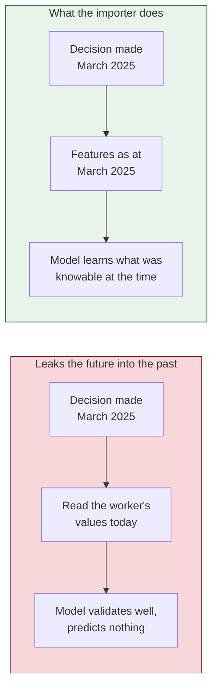

[← Documentation index](../README.md)

# Recording outcomes

> The only source of training labels. No outcomes, no model.

One row per worker per arrival, recorded **after** the fact.

## The critical rule

**Record features as they were at the arrival date, not as they are today.**

A worker who has since been multi-skilled looks, in today's record, like
someone who was always multi-skilled. Training on that teaches the model to use
information nobody had when the decision was made.

This is why `outcomes` carries its own `tenure_months`, `operations_known`,
`skill_grade` and the rest rather than joining to `workers`.

## The two labels

| Column | Values | |
| --- | --- | --- |
| `outcome` | `retained` · `redeployed` · `displaced` | `displaced` is the positive class |
| `retraining_result` | `passed` · `failed` · `not_enrolled` | `passed` is the positive class |

`redeployed` counts as **retained**: the worker kept a job, which is the result
the product exists to produce.

`not_enrolled` rows are **excluded** from the retraining model rather than
counted as failures.

## Uniqueness

`(factory_id, worker_ref, arrival_date)` is unique. A worker may legitimately
appear **once per arrival** they lived through — which is precisely why folds
have to be group-aware. See [Training pipeline](../05-machine-learning/training-pipeline.md).

## The training floor

| | |
| --- | --- |
| **40 rows** minimum | Below this a fit is noise |
| **8 of each result** minimum | A fold with one class has an undefined AUC |

Below either, training refuses and says which condition failed.

## Pseudonymity

`worker_ref` is **your** HR identifier. Nothing here is a name, and the
importer rejects files that carry one.

---

Related: [CSV import](csv-import.md) · [ML overview](../05-machine-learning/ml-overview.md) · [Ethical constraints](../09-ethics/ethical-constraints.md)
