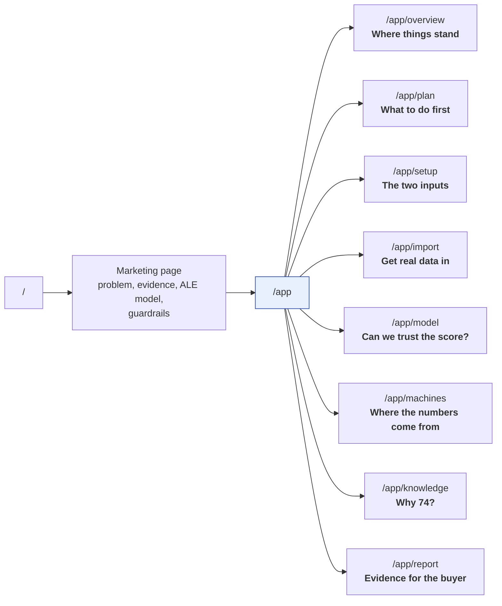

[← Documentation index](../README.md)

# Pages and navigation

Two surfaces behind one router.

## What each page answers

| Page | Question | Notable |
| --- | --- | --- |
| **Overview** | Where does this factory stand? | Four headline figures, risk by role, monthly training load, **purchase economics sorted by payback** |
| **Plan** | What do I start first? | Ordered by how soon training must begin, **not by risk score** |
| **Setup** | What are my inputs? | Role headcounts and the machine roadmap; picking a machine **previews its consequence** before commit |
| **Import** | How do I get real data in? | Server-side datasets listed first — the path that works for large files |
| **Prediction model** | Can I trust this number? | Built around the honest state: most factories land here with no outcomes |
| **Machines** | Where did that figure come from? | 13 entries with sources, per-role impact and operations absorbed |
| **Knowledge base** | Why did this role score 74? | Every rule with its reasoning, source and confidence |
| **Report** | What do I show my buyer? | Dated commitments, printable to PDF |

## First run

A fresh install has no factories, so `/app` lands on **create your first
factory** rather than a dashboard of invented numbers.

## The model page

Deliberately built around the *empty* state, not the happy one. Most factories
arrive with no recorded outcomes, and the correct answer then is that the rule
engine is producing every score — with a progress bar toward the 40-row floor.

## Development-only fill buttons

Gated on `import.meta.env.DEV`, **at the call site** so the whole JSX expression
is eliminated from a production bundle, not merely hidden.

Guarding only inside the component leaves its props behind — the label strings
survived a build until the gate was moved outward.

A deployed demo can opt in explicitly with `VITE_ALE_DEMO_TOOLS=1`. Unset, the
branch tree-shakes away, so the safe default holds for any build that does not
ask.

> A button that merely *looks* hidden is one config mistake away from putting
> invented numbers in front of a factory manager.

---

Related: [Design system](design-system.md) · [Who it is for](../01-overview/who-it-is-for.md)
