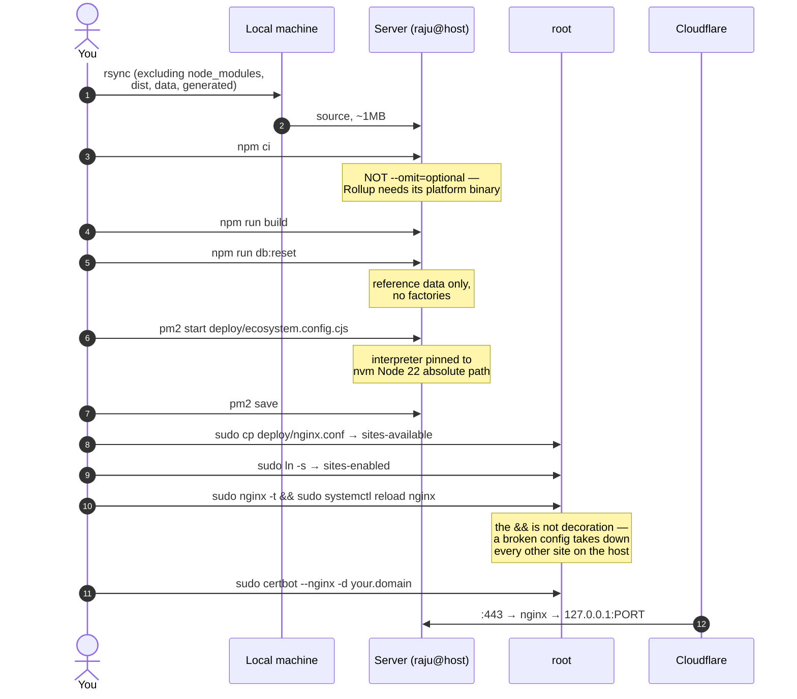

[← Documentation index](../README.md)

# Deployment

One Node process behind one nginx `proxy_pass`. The server serves both the
built frontend and `/api`, so nginx never changes when the app is rebuilt and
there is no static root to keep in step.



## Requirements

**Node 22.6 or newer.** The app uses `node:sqlite` and native TypeScript
execution, neither of which exists on Node 20.

If the host's system Node is older, install 22 with nvm and **pin the absolute
path** in `ecosystem.config.cjs`. pm2 does not inherit a shell's nvm setup, so
a process that runs fine interactively still fails to start under pm2 without
it. This bit during the first deploy.

## Redeploying

```bash
rsync ...
npm run build
pm2 restart worker-saver
```

No nginx change needed.

## Enabling the demo fill buttons

```bash
VITE_ALE_DEMO_TOOLS=1 npm run build
```

Unset, the branch tree-shakes away entirely. See [Pages and navigation](../07-interface/pages-and-navigation.md).

## Live deployment

| | |
| --- | --- |
| URL | `https://worker-saver.shagato.space` |
| Process | pm2 `worker-saver`, port 28710 |
| Node | v22.23.1 via nvm, pinned |
| Reboot | `pm2-raju` enabled, process list saved |

The host runs ~44 other sites. Port 28710 was chosen after checking what was
free; nothing else was touched.

---

Related: [Runbook](runbook.md) · [Configuration](configuration.md) · [System architecture](../02-architecture/system-architecture.md)
