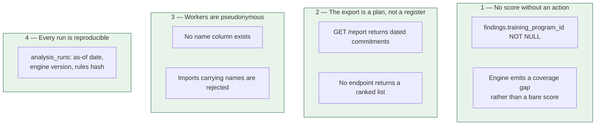

[← Documentation index](../README.md)

# Ethical constraints

> This is an engineering document, not a values statement. Everything below is
> enforced in code, and the test holding each one in place is named.

## The problem

The output that says *"train these 40 people first"* is the same output that
says *"these 40 are the most replaceable."*

ALE Insight builds a ranked list of who is easiest to automate away, and hands
it to the party who would do the automating. Used the wrong way it is a
**redundancy-selection instrument** — the precise inverse of its purpose.

That risk is not managed by intent. It is managed in the schema.

## The four constraints

### 1. No risk score exists without a paired action

`findings.training_program_id` is `NOT NULL`.

A role the engine cannot recommend a transition for produces a **coverage
gap**, reported separately, rather than a score with an empty action column.
The engine enforces it before the database does.

*Held by:* `a role with no training programme yields a gap, not a risk score`

### 2. The exportable document is the transition plan

`GET /api/factories/:id/report` returns dated training commitments. There is
**no endpoint anywhere** that returns a bare ranked displaceability list, and
adding one would be a change to reject in review.

*Held by:* `the report exposes commitments, not a ranked risk register`

### 3. Worker records are pseudonymous by default

The product runs on **role headcounts**, so v1 needs no worker names at all to
be useful. `workers` stores `external_ref` — the factory's own HR identifier —
and has no name column.

This also removes the largest adoption obstacle: a factory gets value without
handing over personal data about thousands of people.

*Held by:* `a worker import carrying names is rejected`

### 4. Every run is attributable and reproducible

`analysis_runs` records the as-of date, engine version and a content hash of
the knowledge base. A report sent to a buyer eight months ago can be re-derived
exactly. When user accounts arrive, the user id joins this table.

*Held by:* `re-running the analysis appends a run` and
`the rules version changes when a risk score changes`

## Excluded features

The model is never trained on age, wage, gender, formal qualification or
performance rating. A model trained on those learns whichever bias produced the
historical decisions and launders it as a prediction. See [Features](../05-machine-learning/features.md).

## Honest numbers

Every risk row carries `rationale`, `source_ref` and `confidence`, all
`NOT NULL`. All 18 seeded rows are marked `estimated`, and the interface shows
that marking **beside the number**.

## Not enforceable in code

Design-partner terms state the tool is not to be used as an input to
redundancy selection.

---

Related: [Data model](../02-architecture/data-model.md) · [Features](../05-machine-learning/features.md) · [Rule engine](../04-engine/rule-engine.md)
