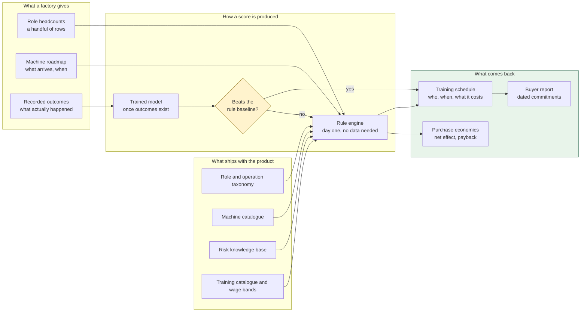

# ALE Insight

> Given a factory's roster and the machines it plans to buy, produce a
> month-by-month training schedule that gets ahead of every arrival — and a
> dated report the factory can hand its buyer.

**Anticipate · Lead · Evolve**

This is an [Obsidian](https://obsidian.md) vault. Open the `docs/` folder as a
vault and the wiki-style links below become a navigable graph. It also reads
fine as plain Markdown on GitHub.

---

## Read in this order

If you are new, four notes give you the whole picture in about fifteen minutes:

1. [[What is ALE Insight]] — what it does and what it refuses to do
2. [[System architecture]] — how the pieces fit
3. [[Rule engine]] — where the numbers come from
4. [[Ethical constraints]] — why the schema looks the way it does

---

## Map of contents

### Overview
- [[What is ALE Insight]]
- [[The problem]] — the evidence the product rests on
- [[The ALE model]] — Anticipate, Lead, Evolve
- [[Who it is for]] — three readers, three questions

### Architecture
- [[System architecture]] — packages, layers, dependency direction
- [[Data model]] — every table and why it exists
- [[Request lifecycle]] — what happens between a click and a number
- [[Technology choices]] — and what each one bought

### Domain
- [[Roles and operations]] — the taxonomy, and why operations matter more than roles
- [[Machine catalogue]] — computed displacement, not estimated
- [[Risk knowledge base]] — every score with its reasoning and provenance
- [[Training and wages]] — what makes a schedule and a payback computable

### The engine
- [[Rule engine]] — the arithmetic, end to end
- [[Scheduling arithmetic]] — working backwards from an arrival date
- [[Golden test]] — how a rule change stays visible

### Machine learning
- [[ML overview]] — why there is no pre-trained model
- [[Features]] — what goes in, and what is deliberately kept out
- [[Training pipeline]] — dataset, folds, candidates, selection
- [[The baseline gate]] — the decision that matters more than the fit
- [[Metrics explained]] — AUC, Brier, calibration, and why accuracy lies

### Data
- [[CSV import]] — validation, partial success, line-level errors
- [[Recording outcomes]] — the only source of labels
- [[CSV templates]] — column reference
- [[Data generator]] — a million realistic rows in three seconds

### Interface
- [[Design system]] — Material 3 tone, generated not picked
- [[Pages and navigation]] — what each screen answers

### Operations
- [[Deployment]] — from a clean host to a live domain
- [[Runbook]] — the things that break, and what to do
- [[Configuration]] — every environment variable

### Reference
- [[API reference]] — every endpoint
- [[Glossary]] — the vocabulary, in one place
- [[Decision log]] — choices made, and what would reverse them
- [[Ethical constraints]] — the four rules enforced in the schema

---

## The shape of the thing, in one diagram



The gate is the important part. A model that cannot beat the lookup table it
replaces is not an improvement, so the rules keep producing scores until one
demonstrably can. See [[The baseline gate]].

---

## Quick start

```bash
npm run setup     # install, migrate, load reference data
npm run dev       # API on :7420, web on :7430
```

A fresh install has **no factories and no rosters** — reference data only.
See [[CSV import]] to get your data in, or [[Data generator]] to make some.
