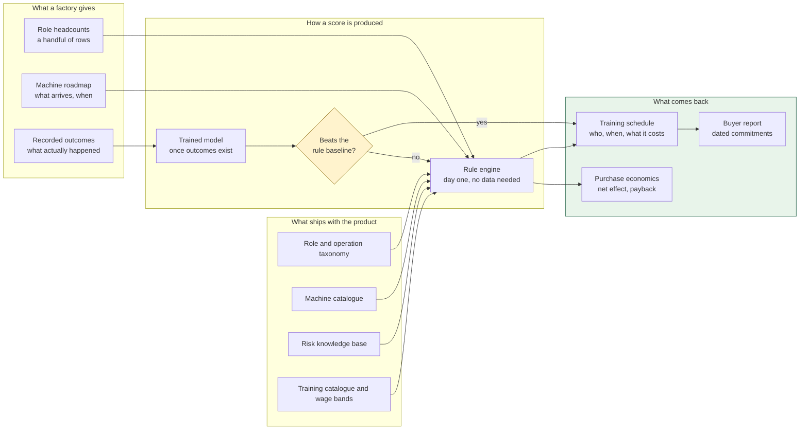

# ALE Insight

> Given a factory's roster and the machines it plans to buy, produce a
> month-by-month training schedule that gets ahead of every arrival — and a
> dated report the factory can hand its buyer.

**Anticipate · Lead · Evolve**

33 notes, 24 Mermaid diagrams. GitHub renders everything here — diagrams
included — so every link below is clickable straight from the repository.

---

## Read in this order

If you are new, four notes give you the whole picture in about fifteen minutes:

1. [What is ALE Insight](01-overview/what-is-ale-insight.md) — what it does and what it refuses to do
2. [System architecture](02-architecture/system-architecture.md) — how the pieces fit
3. [Rule engine](04-engine/rule-engine.md) — where the numbers come from
4. [Ethical constraints](09-ethics/ethical-constraints.md) — why the schema looks the way it does

---

## Map of contents

### Overview
- [What is ALE Insight](01-overview/what-is-ale-insight.md)
- [The problem](01-overview/the-problem.md) — the evidence the product rests on
- [The ALE model](01-overview/the-ale-model.md) — Anticipate, Lead, Evolve
- [Who it is for](01-overview/who-it-is-for.md) — three readers, three questions

### Architecture
- [System architecture](02-architecture/system-architecture.md) — packages, layers, dependency direction
- [Data model](02-architecture/data-model.md) — every table and why it exists
- [Request lifecycle](02-architecture/request-lifecycle.md) — what happens between a click and a number
- [Technology choices](02-architecture/technology-choices.md) — and what each one bought

### Domain
- [Roles and operations](03-domain/roles-and-operations.md) — the taxonomy, and why operations matter more than roles
- [Machine catalogue](03-domain/machine-catalogue.md) — computed displacement, not estimated
- [Risk knowledge base](03-domain/risk-knowledge-base.md) — every score with its reasoning and provenance
- [Training and wages](03-domain/training-and-wages.md) — what makes a schedule and a payback computable

### The engine
- [Rule engine](04-engine/rule-engine.md) — the arithmetic, end to end
- [Scheduling arithmetic](04-engine/scheduling-arithmetic.md) — working backwards from an arrival date
- [Golden test](04-engine/golden-test.md) — how a rule change stays visible

### Machine learning
- [ML overview](05-machine-learning/ml-overview.md) — why there is no pre-trained model
- [Features](05-machine-learning/features.md) — what goes in, and what is deliberately kept out
- [Training pipeline](05-machine-learning/training-pipeline.md) — dataset, folds, candidates, selection
- [The baseline gate](05-machine-learning/the-baseline-gate.md) — the decision that matters more than the fit
- [Metrics explained](05-machine-learning/metrics-explained.md) — AUC, Brier, calibration, and why accuracy lies

### Data
- [CSV import](06-data/csv-import.md) — validation, partial success, line-level errors
- [Recording outcomes](06-data/recording-outcomes.md) — the only source of labels
- [CSV templates](06-data/csv-templates.md) — column reference
- [Data generator](06-data/data-generator.md) — a million realistic rows in three seconds

### Interface
- [Design system](07-interface/design-system.md) — Material 3 tone, generated not picked
- [Pages and navigation](07-interface/pages-and-navigation.md) — what each screen answers

### Operations
- [Deployment](08-operations/deployment.md) — from a clean host to a live domain
- [Runbook](08-operations/runbook.md) — the things that break, and what to do
- [Configuration](08-operations/configuration.md) — every environment variable

### Reference
- [API reference](10-reference/api-reference.md) — every endpoint
- [Glossary](10-reference/glossary.md) — the vocabulary, in one place
- [Decision log](10-reference/decision-log.md) — choices made, and what would reverse them
- [Ethical constraints](09-ethics/ethical-constraints.md) — the four rules enforced in the schema

---

## The shape of the thing, in one diagram



The gate is the important part. A model that cannot beat the lookup table it
replaces is not an improvement, so the rules keep producing scores until one
demonstrably can. See [The baseline gate](05-machine-learning/the-baseline-gate.md).

---

## Quick start

```bash
npm run setup     # install, migrate, load reference data
npm run dev       # API on :7420, web on :7430
```

A fresh install has **no factories and no rosters** — reference data only.
See [CSV import](06-data/csv-import.md) to get your data in, or [Data generator](06-data/data-generator.md) to make some.
